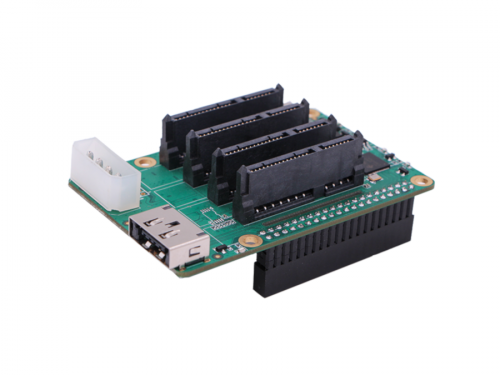

# ROCK Pi Penta SATA HAT

[Penta SATA HAT wiki](<https://wiki.radxa.com/Penta_SATA_HAT>)



Build service:

```shell
make build
```

Build package:

```shell
make deb
```

Build for Raspberry Pi 32-bit:

```shell
make deb ARCH=armhf
```

Build with a custom version:

```shell
make deb VERSION=0.4
```
